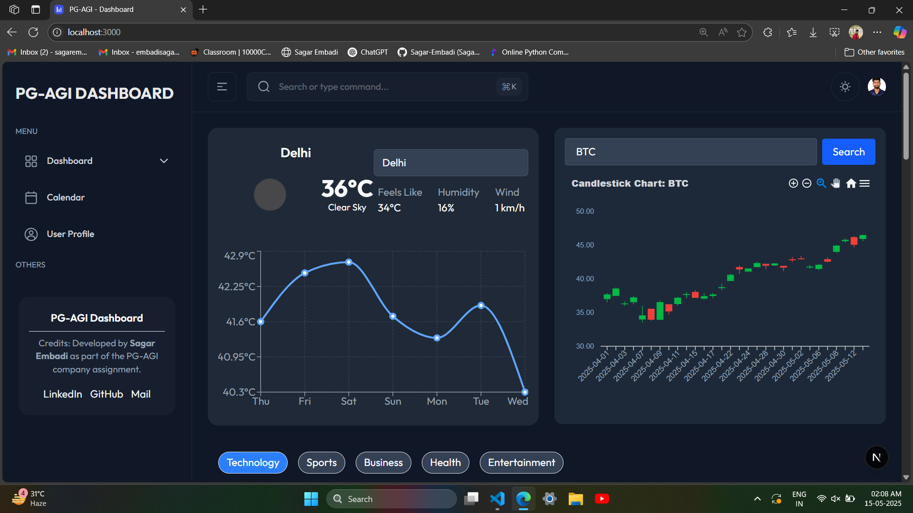
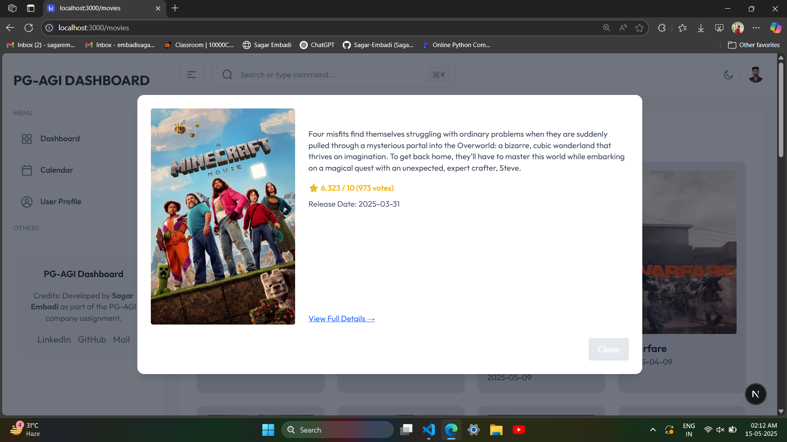
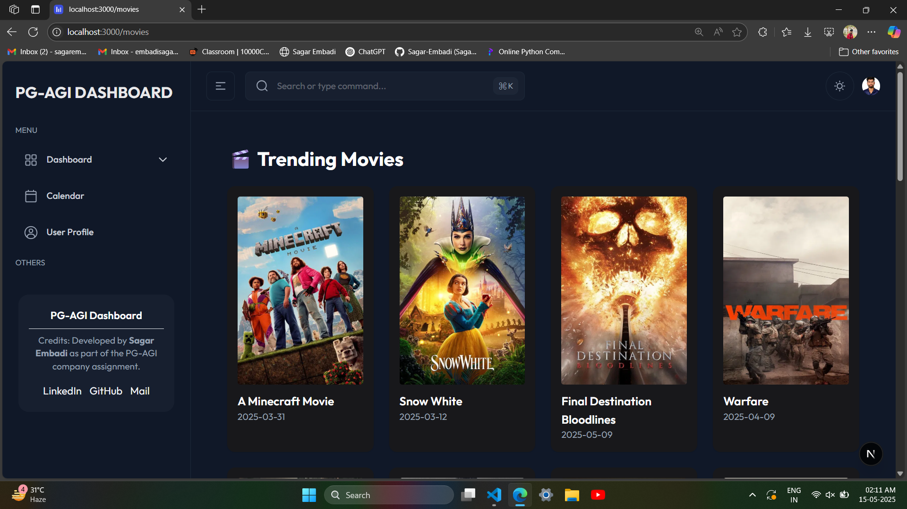
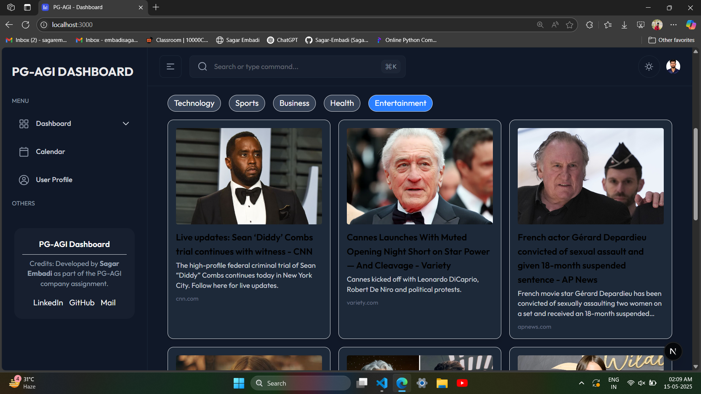

# PGAGI Analytics Dashboard

A comprehensive analytics dashboard built with **Next.js**, **React**, **TypeScript**, and **Tailwind CSS**. This application integrates weather, news, and finance APIs, includes advanced animations, and offers a seamless, performant, and responsive user experience.

---

## 🚀 Project Overview

The PGAGI Analytics Dashboard is a full-featured frontend application developed as part of the PGAGI Front-End Developer Internship assignment. It includes:

- Real-time **Weather**, **News**, **Stock Market** and **Movies** data from public APIs.
- Responsive **UI/UX** with dark mode support.
- Modular architecture with **Redux Toolkit**, **RTK Query**, and **NextAuth.js**.

---

## 🛠️ Technologies Used

- **Next.js** (React Framework)
- **TypeScript**
- **Tailwind CSS**
- **@Clerk/NextAuth.js**
- **Recharts / Chart.js**
- **i18next** for Localization
- **Vercel** for Deployment
- **GitHub Actions** for CI/CD

---

## 📦 Folder Structure

    ├── components/ # Reusable UI components
    ├── pages/ # Next.js pages
    ├── hooks/ # Custom React hooks
    ├── services/ # API integrations
    ├── utils/ # Utility functions
    ├── public/ # Static assets


---

## 🔧 Installation Instructions

1. **Clone the Repository**
```bash
git clone https://github.com/your-username/pgagi-analytics-dashboard.git
cd pgagi-analytics-dashboard
```

## Create .env File

NEXT_PUBLIC_OPENWEATHER_API_KEY=your_openweather_key
NEXT_PUBLIC_GEODB_API_KEY=your_geodb_key
NEXT_PUBLIC_NEWS_API_KEY=your_newsapi_key
NEXT_PUBLIC_ALPHA_VANTAGE_API_KEY=your_alpha_vantage_key
NEXTAUTH_SECRET=your_secret
NEXTAUTH_URL=http://localhost:3000

> Windows Users: place the repository near the root of your drive if you face issues while cloning.

1. Install dependencies:
    ```bash
    npm install
    # or
    yarn install
    ```
    > Use `--legacy-peer-deps` flag if you face peer-dependency error during installation.

2. Start the development server:
    ```bash
    npm run dev
    # or
    yarn dev 
    ```
## 🔗 Deployment

 - **Live Demo:** https://pgagi-dash-board-lyart.vercel.app/
 - Hosted on Vercel

## Deployment Notes
- CI/CD pipeline set up with GitHub Actions
- Environment variables configured via platform dashboard
- Automatic deployments on push to main

## 🌐 Environment Variables

**Variable**        	            **Description**
NEXT_PUBLIC_OPENWEATHER_API_KEY	    Weather data from OpenWeatherMap
NEXT_PUBLIC_GEODB_API_KEY	        City autocomplete (GeoDB Cities API)
NEXT_PUBLIC_NEWS_API_KEY	        News data from NewsAPI
NEXT_PUBLIC_ALPHA_VANTAGE_API_KEY	Stock market data
NEXTAUTH_SECRET	                    Used for session encryption
NEXTAUTH_URL	                    Base URL for authentication

## 🔌 API Setup

## 🌀 Weather
 - OpenWeatherMap : https://openweathermap.org/api

## 📰 News
 - NewsAPI : https://newsapi.org

## 📈 Finance
  - Alpha Vantage : https://www.alphavantage.co

## 🌟 Features

- 🌤 Weather Dashboard: Current weather + 7-day forecast with charts

- 🗞 News Feed: Categorized, filterable headlines with infinite scroll

- 💹 Stock Viewer: Real-time prices, candlestick charts, autocomplete

- 🎨 Dark Mode: Smooth transition toggle with persistence

- 🔐 Authentication: Email/password & OAuth via NextAuth.js

- ⏱ Real-Time Updates: Live stocks, weather, and news alerts

- 📱 Fully Responsive: Optimized for all screen sizes

## 📸 Screenshots

Dashboard	Dark Mode

<table>
  <tr>
    <td></td>
    <td></td>
  </tr>
  <tr>
    <td></td>
    <td></td>
  </tr>
</table>

## Recorded Video
[▶️ Watch Loom Video](https://www.loom.com/share/97396b0753a241bbbb69f59da695477f?sid=3205a813-e4a1-4747-8f98-5916806557d4)
[🎥 Download demo video](./public/videos/20250514-2056-15.2993501.mp4)

## 📝 Additional Notes
- Mock data is used in fallback when API rate limits are hit
- Environment-aware API handling and error boundaries
- Reusable design system and component library

## 👨‍💻 Author
**Sagar Embadi** <br>
**MREN Stack Developer**
 - GitHub : https://github.com/Sagar-Embadi
 - LinkedIn : https://www.linkedin.com/in/sagar-embadi
 - Mail : sagarembadi7@gmail.com

## 📜 License
This project is licensed under the MIT License.

## 💼 Assignment
This project was completed as part of the PGAGI Front-End Developer Internship Assignment.
Assignment PDF
